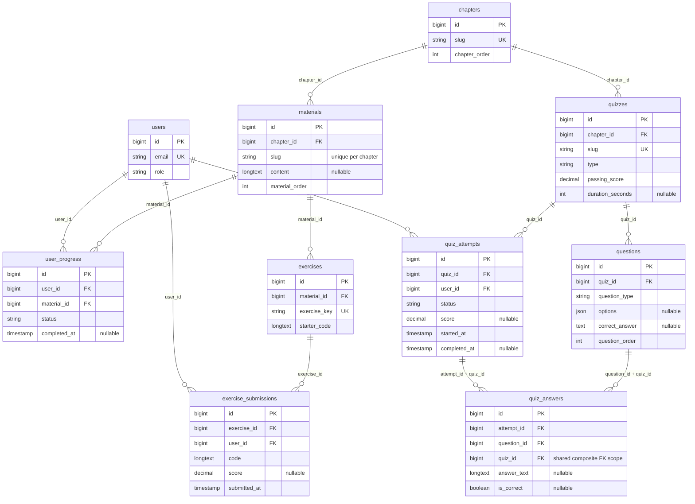

# Database OOPy

## Tujuan dan cakupan

Lapisan database menyediakan katalog pembelajaran, progres pengguna, riwayat
coding, kuis BAB 1–6 dan Evaluasi Akhir BAB 7. Semua tipe soal menggunakan satu
tabel `questions`; opsi pilihan ganda berupa JSON, bukan tabel opsi terpisah.
Desain_Database.pdf tidak tersedia dalam workspace, sehingga struktur mengikuti
spesifikasi tugas dan konten repository yang telah diaudit.

Pada tahap ini controller, Blade, JavaScript, Monaco/Pyodide dan localStorage
tetap menggunakan implementasi existing. Membuat tabel tidak otomatis memindahkan
progres browser ke server. Python pengguna tetap dieksekusi di Pyodide browser.
Mini project BAB 7 yang telah dihapus tidak dibuat ulang atau disemai.

## Sepuluh tabel utama

| Tabel | Model | Fungsi |
| --- | --- | --- |
| users | User | Identitas autentikasi Laravel dan peran user/admin. |
| chapters | Chapter | Metadata tujuh BAB. |
| materials | Material | Identitas materi PHP BAB 1–6; konten DB opsional. |
| user_progress | UserProgress | Satu progres pengguna per materi. |
| exercises | Exercise | Identitas latihan coding dan starter. |
| exercise_submissions | ExerciseSubmission | Banyak pengumpulan coding per pengguna/latihan. |
| quizzes | Quiz | Enam chapter_quiz dan satu final_exam. |
| questions | Question | Pilihan ganda, isian kode, dan uraian. |
| quiz_attempts | QuizAttempt | Banyak percobaan per pengguna/kuis. |
| quiz_answers | QuizAnswer | Satu jawaban per percobaan/soal. |

`sessions`, `password_reset_tokens`, `cache`, `cache_locks`, `jobs`, `job_batches`,
`failed_jobs`, serta `migrations` adalah infrastruktur Laravel. Tabel tersebut
dipertahankan dan tidak termasuk sepuluh tabel aplikasi. Setelah penerapan lokal,
database mempunyai 18 tabel termasuk infrastruktur, seluruhnya InnoDB.

## Kamus data

Untuk sembilan tabel baru, `id` adalah BIGINT UNSIGNED AUTO_INCREMENT PK.
Semua FK menggunakan BIGINT UNSIGNED, konsisten dengan `users.id` bawaan Laravel.
Semua tabel memiliki `created_at`/`updated_at` TIMESTAMP nullable yang diisi Eloquent.
String memakai utf8mb4/utf8mb4_unicode_ci dari konfigurasi koneksi.

### users

Field autentikasi bawaan dipertahankan: id, name VARCHAR(255), email VARCHAR(255)
UNIQUE, email_verified_at TIMESTAMP nullable, password VARCHAR(255),
remember_token VARCHAR(100) nullable, dan timestamps. Migration tambahan menambah
role ENUM(user,admin) NOT NULL DEFAULT user serta index role.

User tetap memakai password cast `hashed`, password/remember_token disembunyikan,
dan role cast string. Role **tidak mass assignable** agar input registrasi kelak
tidak dapat menaikkan hak akses. Perubahan role hanya melalui kode tepercaya,
misalnya `$user->forceFill(['role' => 'admin'])->save()` setelah pemeriksaan izin.
Tidak ada akun admin, password tetap atau akun demo yang dibuat oleh seeder.

### chapters

| Field | Tipe | Constraint |
| --- | --- | --- |
| slug | VARCHAR(191) | NOT NULL, UNIQUE; alpha_dash ASCII pada model. |
| title | VARCHAR(255) | NOT NULL. |
| description | TEXT | Nullable. |
| chapter_order | INT UNSIGNED | NOT NULL, index, harus > 0. |

### materials

| Field | Tipe | Constraint |
| --- | --- | --- |
| chapter_id | BIGINT UNSIGNED | FK chapters.id, RESTRICT DELETE. |
| slug | VARCHAR(191) | NOT NULL; UNIQUE(chapter_id,slug). |
| title | VARCHAR(255) | NOT NULL. |
| content | LONGTEXT | Nullable; tidak diisi otomatis dari array PHP. |
| material_order | INT UNSIGNED | DEFAULT 1, harus > 0; index(chapter_id,material_order). |

Seeder membuat satu identitas materi per file BAB 1–6, bukan satu baris untuk
setiap section. Subbab tetap merupakan data section pada PHP. Lookup materi
existing menggunakan chapter.slug/material.slug yang sama dengan registry.
BAB 7 adalah evaluasi sehingga tidak membutuhkan baris materials. Jika kelak
section dipindahkan menjadi materi tersendiri, rencanakan backfill progres dan
pemetaan slug sebelum mengubah granularitas ini.

### user_progress

| Field | Tipe | Constraint |
| --- | --- | --- |
| user_id | BIGINT UNSIGNED | FK users.id, RESTRICT DELETE. |
| material_id | BIGINT UNSIGNED | FK materials.id, RESTRICT DELETE. |
| status | ENUM | not_started (default), in_progress, completed. |
| completed_at | TIMESTAMP | Nullable; wajib diisi hanya untuk completed. |

UNIQUE(user_id,material_id) mencegah duplikasi; index(user_id,status) membantu
dashboard progres. Mengembalikan status ke in_progress/not_started harus disertai
completed_at NULL.

### exercises

| Field | Tipe | Constraint |
| --- | --- | --- |
| material_id | BIGINT UNSIGNED | FK materials.id, RESTRICT DELETE. |
| exercise_key | VARCHAR(191) | UNIQUE, NOT NULL; sama dengan id konfigurasi PHP. |
| title | VARCHAR(255) | NOT NULL. |
| instruction | TEXT | NOT NULL; deskripsi existing, termasuk token backtick. |
| starter_code | LONGTEXT | NOT NULL; source entry file latihan existing. |
| expected_output | LONGTEXT | Nullable jika sumber tidak menyediakannya. |

Ketujuh latihan saat ini memakai main.py. Checker dan peta seluruh file tetap
di PHP, dihubungkan melalui exercise_key. Contoh output materi tidak dianggap
sebagai expected_output latihan jika source tidak menyatakannya. Demo `/editor`
bukan latihan BAB sehingga tidak dimasukkan ke katalog exercises.

### exercise_submissions

| Field | Tipe | Constraint |
| --- | --- | --- |
| exercise_id | BIGINT UNSIGNED | FK exercises.id, RESTRICT DELETE. |
| user_id | BIGINT UNSIGNED | FK users.id, RESTRICT DELETE. |
| code | LONGTEXT | NOT NULL. |
| output | LONGTEXT | Nullable. |
| status | ENUM | submitted (default), passed, failed, error. |
| score | DECIMAL(5,2) | Nullable; 0–100 jika diisi. |
| submitted_at | TIMESTAMP | NOT NULL; model mengisi now() jika tidak diberikan. |

Index(user_id,exercise_id,submitted_at). Tidak ada UNIQUE(user_id,exercise_id):
riwayat mendukung beberapa pengumpulan. Score adalah progres teknis latihan,
bukan nilai seluruh desain atau progres kursus. Cast score decimal:2 berupa string
agar presisi tidak hilang, submitted_at datetime.

### quizzes

| Field | Tipe | Constraint |
| --- | --- | --- |
| chapter_id | BIGINT UNSIGNED | FK chapters.id, RESTRICT DELETE. |
| slug | VARCHAR(191) | UNIQUE, NOT NULL. |
| title | VARCHAR(255) | NOT NULL. |
| type | ENUM | chapter_quiz atau final_exam. |
| passing_score | DECIMAL(5,2) | DEFAULT 80, rentang 0–100. |
| duration_seconds | INT UNSIGNED | Nullable, jika diisi harus > 0. |

Index(chapter_id,type). Slug kuis BAB = `kuis-<slug-bab>`; final_exam memakai
`evaluasi-akhir`. Kuis BAB bernilai minimum 80 dengan durasi NULL. Evaluasi akhir
memakai config/evaluasi.php: ambang objektif 70 dan durasi 2400 detik saat ini.
Tidak ada tabel final_exams atau aturan jeda ulang.

### questions — satu tabel seluruh pertanyaan

| Field | Tipe | Constraint |
| --- | --- | --- |
| quiz_id | BIGINT UNSIGNED | FK quizzes.id, RESTRICT DELETE. |
| question_type | ENUM | multiple_choice, code_fill, essay. |
| question_text | TEXT | NOT NULL. |
| code_snippet | LONGTEXT | Nullable; wajib untuk code_fill. |
| options | JSON | Nullable, cast array. |
| correct_answer | TEXT | Nullable, cast string; indeks 0-based untuk PG. |
| explanation | TEXT | Nullable; berasal dari sumber jika tersedia. |
| question_order | INT UNSIGNED | NOT NULL, > 0. |

UNIQUE(quiz_id,question_order) sekaligus menyediakan index gabungan urutan soal.
UNIQUE(id,quiz_id) menjadi candidate key FK gabungan dari quiz_answers.

- Multiple choice: options adalah list dengan >=2 string tidak kosong; indeks
  correct_answer berbentuk digit kanonis (0,1,2,...), harus tersedia dalam list.
- Code fill: code_snippet/correct_answer tidak kosong, options NULL.
- Essay: options dan correct_answer NULL. Teks uraian tidak dinilai otomatis.

Konsep rancangan quiz_questions/quiz_options digabung menjadi questions dan JSON
options. Tidak ada tabel pertanyaan lain atau option_id. Semua soal awal disalin
dari PHP, termasuk isian yang berupa assignment/decorator/pemanggilan super().
Model menolak perubahan konten/kontrak soal yang telah dijawab agar reseeding
tidak diam-diam menulis ulang riwayat penilaian. Perubahan versi soal yang sudah
dipakai memerlukan proses versioning tersendiri.

### quiz_attempts

| Field | Tipe | Constraint |
| --- | --- | --- |
| quiz_id | BIGINT UNSIGNED | FK quizzes.id, RESTRICT DELETE. |
| user_id | BIGINT UNSIGNED | FK users.id, RESTRICT DELETE. |
| status | ENUM | in_progress (default), completed, expired. |
| score | DECIMAL(5,2) | Nullable, 0–100; bagian objektif. |
| started_at | TIMESTAMP | NOT NULL; model mengisi now() jika tidak diberikan. |
| completed_at | TIMESTAMP | NULL saat in_progress, wajib ketika selesai/expired dan >= started_at. |

Index(user_id,quiz_id,started_at), UNIQUE(id,quiz_id) untuk FK gabungan.
Beberapa percobaan pada kuis yang sama diperbolehkan. Completed berarti sesi
dikumpulkan, bukan semua uraian sudah dinilai atau pengguna lulus keseluruhan.
Score cast decimal:2; kedua timestamp cast datetime. Backend grading kelak harus
membandingkan rasio objektif sebelum pembulatan, bukan menentukan kelulusan dari
angka tampilan yang dibulatkan.

### quiz_answers

| Field | Tipe | Constraint |
| --- | --- | --- |
| attempt_id | BIGINT UNSIGNED | Bagian FK gabungan ke quiz_attempts. |
| question_id | BIGINT UNSIGNED | Bagian FK gabungan ke questions. |
| quiz_id | BIGINT UNSIGNED | Scope yang diturunkan dari attempt, tidak mass assignable. |
| answer_text | LONGTEXT | Nullable; indeks pilihan, kode atau uraian. |
| is_correct | BOOLEAN | Nullable; NULL untuk uraian belum dinilai. |

UNIQUE(attempt_id,question_id). Kolom quiz_id tambahan sengaja digunakan untuk
integritas database, bukan tabel baru:

- FK(attempt_id,quiz_id) → quiz_attempts(id,quiz_id), CASCADE DELETE.
- FK(question_id,quiz_id) → questions(id,quiz_id), RESTRICT DELETE.

Dengan kedua FK, raw insert pun tidak bisa menghubungkan attempt dan question
dari kuis berbeda. Model menurunkan quiz_id dan memvalidasi relasi sebelum save.
Trigger INSERT/UPDATE menolak is_correct non-NULL untuk essay; NULL tidak pernah
diubah menjadi false oleh cast boolean. Penilaian manual uraian belum dihubungkan;
menambahnya kelak memerlukan kebijakan grading dan revisi guard yang sesuai.

## Validasi dan kebijakan penghapusan

LearningModel memvalidasi field pada saving untuk sembilan model pembelajaran.
Tipe JSON/list/string opsi diperiksa oleh model. Database juga menegakkan PK/FK,
unique, enum, batas urutan/nilai/durasi, konsistensi timestamp status, bentuk dasar
soal (JSON array, panjang, indeks, nullable) serta essay is_correct NULL.
Query builder/mass update tidak menjalankan hook Eloquent: gunakan model saat
authoring, khususnya untuk validasi setiap string opsi dan perlindungan soal
yang sudah dijawab. Pembatasan ini bukan pengganti authorization.

Referensi katalog/user/materi/latihan/kuis/soal memakai RESTRICT supaya penghapusan
parent tidak menghilangkan riwayat. Hanya jawaban milik attempt yang sengaja
dihapus ikut CASCADE. Penghapusan tersebut harus menjadi keputusan layanan
berotorisasi pada tahap integrasi, bukan tindakan otomatis seeder.

MySQL membutuhkan 8.0.16+ untuk CHECK yang ditegakkan, sehingga migration menolak
server yang lebih tua. MariaDB lokal 10.4.32 juga menjalankan CHECK. Untuk SQLite
in-memory, trigger BEFORE INSERT/UPDATE menerapkan predicate yang setara karena
CHECK tidak bisa ditambahkan melalui ALTER TABLE dengan grammar existing.
[Dokumentasi CHECK MySQL](https://dev.mysql.com/doc/refman/8.0/en/create-table-check-constraints.html),
[FK gabungan SQLite](https://www.sqlite.org/foreignkeys.html).

Pada MySQL, kolom options menggunakan JSON native. MariaDB menyimpan JSON sebagai
alias LONGTEXT; aplikasi tetap menggunakan deklarasi json() dan cast array.
[Dokumentasi JSON MariaDB](https://mariadb.com/docs/server/reference/data-types/string-data-types/json).

## Relasi Eloquent dan ERD

Chapter.materials/quizzes; Material.chapter/exercises/userProgress;
User.progress/exerciseSubmissions/quizAttempts; Exercise.material/submissions;
ExerciseSubmission.exercise/user; UserProgress.user/material; Quiz.chapter/questions/attempts;
Question.quiz/answers; QuizAttempt.user/quiz/answers; QuizAnswer.question/attempt.
Question order otomatis diterapkan pada Quiz.questions dan material_order pada
Chapter.materials. QuizAttempt.answers memakai FK attempt_id secara eksplisit.



## Konfigurasi MySQL dan menjalankan perubahan

Gunakan PHP 8.2+ dengan pdo_mysql dan server MySQL 8.0.16+ yang sudah terpasang.
Pada database baru, buat schema sekali menggunakan akun DBA:

```sql
CREATE DATABASE IF NOT EXISTS oopy CHARACTER SET utf8mb4 COLLATE utf8mb4_unicode_ci;
```

Database lokal oopy sudah ada dan telah diperiksa; perintah tersebut tidak perlu
diulang untuk workspace ini. Tidak ada database/tabel lama yang dihapus.
Jika memasang ulang dependensi PHP pada clone baru: `composer install`.
Atur nilai nyata pada .env sendiri (gunakan akun aplikasi dengan privilege yang
sesuai, dan jangan commit password):

```dotenv
DB_CONNECTION=mysql
DB_HOST=127.0.0.1
DB_PORT=3306
DB_DATABASE=oopy
DB_USERNAME=<akun_database>
DB_PASSWORD=<password_database>
DB_CHARSET=utf8mb4
DB_COLLATION=utf8mb4_unicode_ci
```

Privilege untuk deployment mencakup CREATE/ALTER/INDEX/REFERENCES/TRIGGER serta
SELECT/INSERT/UPDATE; privilege runtime dapat dibatasi setelah migrasi.
Koneksi existing tidak diubah. Tabel baru menetapkan engine InnoDB secara eksplisit.
Jika .env diubah pada environment dengan config cache, jalankan `php artisan config:clear`.

```powershell
php artisan migrate:status
php artisan migrate --pretend
php artisan migrate
php artisan db:seed --class=OopyContentSeeder
# Alternatif default seeder, tanpa akun demo/admin:
php artisan db:seed
```

Di deployment noninteraktif tambahkan --force sesuai proses deployment. Jangan
gunakan migrate:fresh, db:wipe, truncate atau DROP DATABASE untuk penerapan ini.
Seeder idempotent dengan updateOrCreate/firstOrCreate dan transaksi; ia tidak
memangkas data tambahan, mengganti IDs, menghapus riwayat, atau menimpa content
materi yang telah ditulis ke DB. Checker tidak disalin/diubah dan Python tidak
dijalankan oleh PHP. Jika soal yang telah dijawab berubah dalam sumber, seeding
berhenti dengan ValidationException; rencanakan versioning/backfill dahulu.

Urutan migration baru (semua prefix 2026_10_09):

1. 000001_add_role_to_users_table
2. 000002_create_chapters_table
3. 000003_create_materials_table
4. 000004_create_user_progress_table
5. 000005_create_exercises_table
6. 000006_create_exercise_submissions_table
7. 000007_create_quizzes_table
8. 000008_create_questions_table
9. 000009_create_quiz_attempts_table
10. 000010_create_quiz_answers_table
11. 000011_add_learning_integrity_constraints

Tiga migration bawaan tidak diubah. Down menghapus tabel sesuai urutan terbalik
ketika aman; pengumpulan/progres/attempt/answer menolak rollback ketika berisi
data. Migration integrity menolak rollback sebelum melepas guard bila ada
riwayat pengguna, content materi non-NULL, atau role admin. Role migration juga
menolak penghapusan role privileged. Ekspor dan rencanakan rollback/backfill
sebelum mengubah schema yang sudah dipakai. Rollback hanya diuji pada SQLite
in-memory; tidak dijalankan terhadap database lokal oopy.

## Sumber data awal

OopyContentSeeder membaca chapters.php beserta setiap file content yang terdaftar.
Data akhir: 7 chapters, 6 materials, 7 exercises, 7 quizzes, 50 questions.
Enam kuis masing-masing 3 PG + 2 code_fill = 30 soal; final_exam berisi
10 PG + 5 code_fill + 5 essay = 20. Total tipe: 28 PG, 17 code_fill, 5 essay.
Jawaban/opsi/kode/explanation mengikuti PHP; explanation final NULL jika tidak
disediakan source. Empat tabel riwayat pengguna kosong sampai integrasi backend
dibuat. User seeder tidak membuat akun dengan password tetap.

## Contoh query

Contoh memerlukan pengguna nyata yang sudah ada; kode berikut tidak membuat akun.

```php
use App\Models\User;
use App\Models\UserProgress;
use App\Models\QuizAttempt;

$progress = User::findOrFail($userId)->progress()
    ->with('material.chapter')->get();

UserProgress::updateOrCreate(
    ['user_id' => $userId, 'material_id' => $materialId],
    ['status' => 'completed', 'completed_at' => now()]
);

$history = User::findOrFail($userId)->quizAttempts()
    ->with('quiz.chapter', 'answers.question')->latest('started_at')->get();

$finalResults = QuizAttempt::where('user_id', $userId)
    ->whereHas('quiz', fn ($query) => $query->where('type', 'final_exam'))
    ->whereIn('status', ['completed', 'expired'])
    ->with('quiz', 'answers.question')->latest('completed_at')->get();
// score adalah nilai objektif; answers essay tetap is_correct NULL.
```

## Verifikasi yang dijalankan — 9 Oktober 2026

| Pemeriksaan | Hasil |
| --- | --- |
| php artisan test --compact | 43 tes lulus, 1725 assertions; 10 tes DB memakai SQLite in-memory. |
| node --test tests/js/*.test.js | 19 tes lulus, termasuk runtime/checker/materi dan evaluasi existing. |
| php artisan migrate --pretend --no-ansi | SQL tambahan berhasil dikompilasi pada koneksi mysql existing. |
| php artisan migrate --force --no-ansi | 11 migration tambahan diterapkan pada oopy, batch 2; tiga bawaan tetap batch 1. |
| php artisan db:seed --class=OopyContentSeeder --force --no-ansi | Seed pertama berhasil. |
| Default db:seed melalui Artisan, --force | Seed kedua berhasil; jumlah dan ID pertanyaan tetap, tidak membuat user. |
| Pemeriksaan transaksi MariaDB | FK/unique/CHECK/JSON, relasi, multi-attempt, skor, cross-quiz dan essay NULL lulus; fixture selalu rollback. |
| Pint untuk seluruh file pekerjaan dan git diff --check | Lulus. |

Server tersedia adalah MariaDB 10.4.32 melalui driver mysql, bukan native MySQL 8.
Native MySQL 8 belum dijalankan karena tidak tersedia; Docker daemon juga tidak
berjalan. Kompatibilitas MySQL ditopang grammar Laravel, SQL preview dan fitur
CHECK/FK yang didokumentasikan, bukan klaim eksekusi native MySQL 8.

Audit awal: users kosong, hanya sembilan tabel Laravel, migrations count 3,
tidak ada quiz_questions/quiz_options atau tabel legacy pembelajaran dengan data.
Sesudah penerapan: 18 tabel InnoDB, 14 migration tercatat, users tetap kosong,
progres/submission/attempt/answer tetap kosong, serta 50 soal source tersimpan.
Test transaksi menggunakan data sementara dan password acak, lalu rollback;
tidak ada data pengguna yang dihapus atau akun verifikasi yang ditinggalkan.
Peringatan PHP OpenSSL dimuat dua kali tetap berasal dari konfigurasi lingkungan
dan tidak menggagalkan pengujian. .env, frontend, database server settings,
database default migrations dan engine Python tidak diubah.

## Tahap integrasi berikutnya

1. Tambahkan autentikasi, authorization/policies dan kontrol role sebelum API
   progres/riwayat dapat diakses; validasi ownership di server.
2. Buat layanan percobaan/penilaian objektif berdasarkan bank soal DB, deadline
   dan kebijakan server; jangan percaya skor/is_correct/localStorage dari client.
3. Rancang snapshot/versioning soal dan passing policy agar editing bank soal
   tidak mengubah riwayat. Sediakan grading manual uraian dengan audit yang benar.
4. Hubungkan progres dan pengumpulan browser ke endpoint secara bertahap;
   migrasi localStorage harus dianggap data latihan tak tepercaya, bukan nilai resmi.
5. Migrasikan konten PHP atau proyek multi-file hanya setelah ada mapping/source
   dan backfill yang diuji. Pertahankan eksekusi Python di Pyodide.
6. Jalankan suite pada native MySQL 8 dalam CI/server testing terpisah sebelum
   deployment ke engine tersebut. Tidak ada commit atau push otomatis pada pekerjaan ini.
